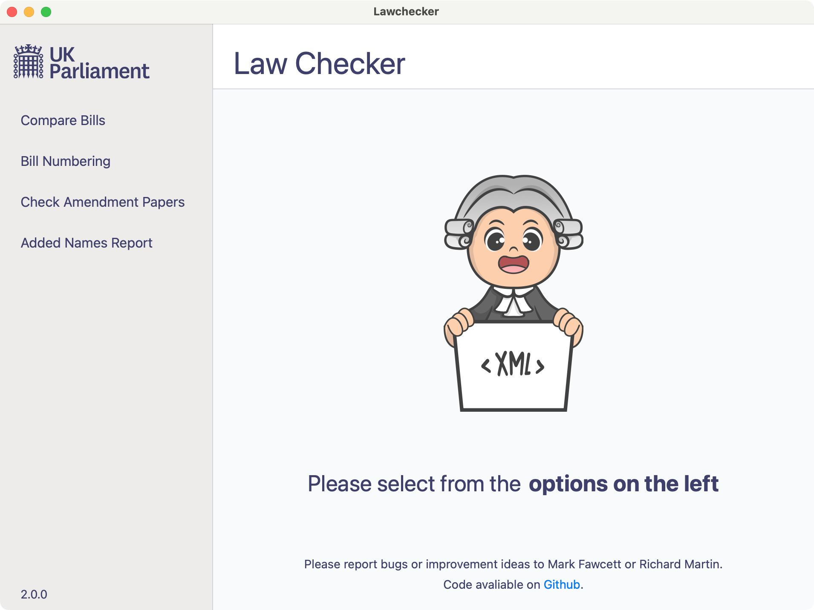

<p align="center">
  
</p>

# LawChecker

Automated checks/compares for UK Parliament legislative papers.

You can create:
- an HTML report which compares two Bill XML files
- CSV files showing changes to clause (a.k.a. section) and schedule paragraph numbers
- an HTML report which compares two Amendment paper XML files
- an HTML added names report
- an HTML report which compares an amendment paper of proceedings paper and Amendments on the parliament website

## Installation
Clone the repository if you have not already done so. [Here is a guide to cloning](https://www.youtube.com/watch?v=CKcqniGu3tA).
Install a recent version of [Python](https://www.python.org/downloads/) if you have not got one.

**If you wish to change the code** and/or create a distributable version (e.g. a .exe file on windows), you will need to have [Node](https://nodejs.org/en) installed too.

### Create and activate a python virtual environment (optional, recommended).
To create a virtual environment run the following in PowerShell on Windows or in the terminal on Mac or Linux.

<details>
<summary>On Windows</summary>

Create:
```bash
python -m venv venv
```

To activate on Windows, run:
```powershell
venv\Scripts\Activate.ps1
```

If you run into permission trouble, [this article](https://dev.to/aka_anoop/enabling-virtualenv-in-windows-powershell-ka3) may help.
</details>

<details>
<summary>On Mac OS (or Linux)</summary>

Create:
```bash
python3 -m venv venv
```

To activate, run:
```bash
source venv/bin/activate
```
</details>

### Install the package (Required)

If you want only to run the code, install the python package with:
```bash
pip install .
```

Or if you intend to change the code (or create a distributable version), install the python package in editable mode with development dependencies:
```bash
pip install -e .[dev]
```
*and* install the node dependencies:
```bash
npm install
```


## Usage
Once installed there are six entry points. You can run these from the command line/terminal/powershell.
 - `startgui` will start a graphical user interface (seen above) which lets you create all of the below reports.
 - `compare_bills` creates a report detailing the differences between two Bill files. Type `compare_bills --help`  for usage info.
 - `bill_numbering` creates a CSV file showing changes to clause (a.k.a. section) and schedule paragraphs numbers. Type `bill_numbering --help`  for usage info.
 - `compare_report` creates a report detailing the differences between two Amendment paper XML files. Type `compare_report --help` for usage info.
 - `an_report` creates an added names report. Type `an_report --help` in your terminal or command prompt for help on how to use this.
 - `web_amendments` creates a report detailing the differences an amendment paper of proceedings paper and Amendments on the parliament webste. Type `web_amendments --help` for usage info.

### Examples

#### compare_report example
```bash
compare_report example_files/amendments/energy_rm_rep_0901.xml example_files/amendments/energy_rm_rep_0904.xml
```

#### compare_bills example
```bash
compare_bills "example_files/bills/Data Protection and Digital Information Bill - commons introduced.xml" "example_files/bills/Data Protection and Digital Information Bill - commons committee.xml"
```

See [examples.md](example_files/examples.md) for more

## Tests
To run tests `pytest tests/`

## Create Standalone .exe or .app file

On Windows you can create a standalone executable file (.exe file). On a Mac you can create a .app file. These will allow you to run the graphical version of this program on a computer without python or other dependencies installed. You can distribute the resulting .exe or .app files to other users but since they are not signed users may get a warning about security or be prevented from running the program.

You will need to be using a Windows computer to create the .exe file. And you will need to be using a Mac computer to create the .app file. You will also need to have Node installed (see installation above). On either sort of computer run the following command in the terminal or powershell:
```bash
npm run build
```

You should then see the resulting file in the `dist` folder.
